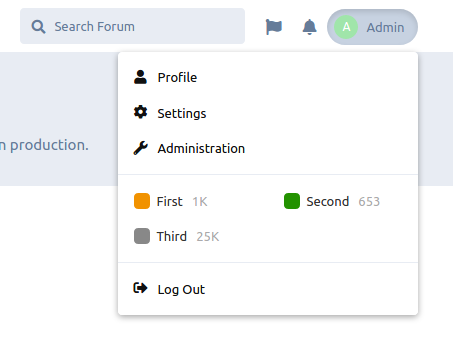

# Tags in Menu

An example Flarum extension that adds a list of tags in the session dropdown, similar to Discourse.

This extension is published as an example and can't be installed from Packagist.
Feel free to fork into your own extension or copy parts of the code.

Notable missing features:

- On desktop view, both the normal list (from Tags extension) and the new tags list are visible
- When logged out, the new tags list cannot be accessed (because it's in the session dropdown)
- There's no check making sure the Tags extension is enabled
